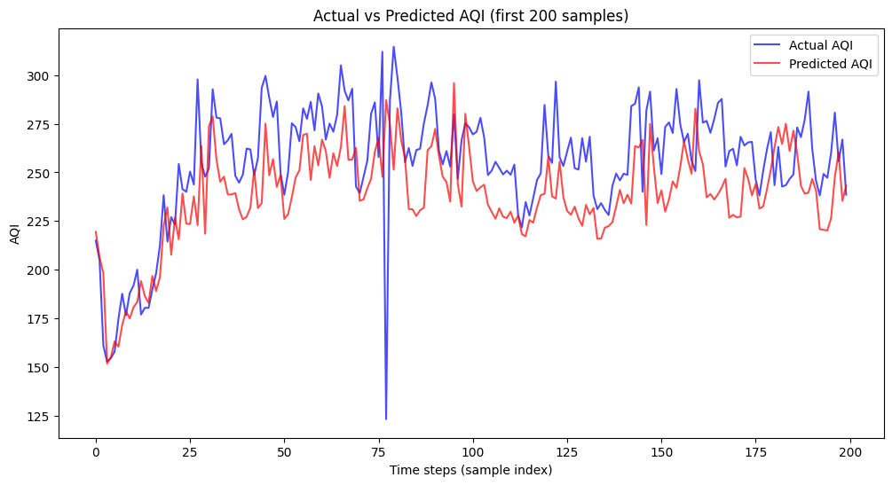

```markdown
# Air Quality Index (AQI) Prediction with GRU

This project focuses on predicting **Air Quality Index (AQI)** using deep learning, specifically **GRU (Gated Recurrent Unit)** models, from multi-station air pollution data.

---

## Project Description
Air pollution forecasting is important for public health and urban planning.  
In this project, we:
1. **Preprocess** air quality data from multiple monitoring stations.  
2. **Build time-series sequences** (sliding window of 48 hours).  
3. **Train GRU-based models** for AQI prediction.  
4. **Evaluate** predictions with AQI metrics (MAE, RMSE) and dominant pollutant accuracy.  

We explore two approaches:
- **Multi-station (multi-channel input)**: Combine features from all 6 stations → GRU learns spatial & temporal relations.  
- **Single-station**: Train and predict for one station independently.  

---

## Dataset
- Collected from **6 monitoring stations** in Ho Chi Minh City.  
- Features per station:
  - Pollutants: `PM2.5, O3, CO, NO2, SO2`  
  - Weather: `Temperature, Humidity`  
- Common time axis across stations.  

Example structure:
```

date, Station\_No, PM2.5, O3, CO, NO2, SO2, Temperature, Humidity
2021-02-23 21:00, 1, 32.9, 15.6, 55.4, 1330.4, 112.7, 28.3, 63.1

````

---

## Methodology

### 1. Data Preprocessing
- Missing values handled with forward-fill.
- Normalization with **MinMaxScaler**.
- Sliding window of **48 hours** to create sequences.

### 2. Model Architecture (GRU)
```python
model = Sequential([
    GRU(128, return_sequences=True, input_shape=(48, num_features)),
    Dropout(0.2),
    GRU(64, return_sequences=False),
    Dropout(0.2),
    Dense(32, activation="relu"),
    Dense(num_targets)  # pollutants to predict
])
````

### 3. Evaluation Metrics

* **MAE (Mean Absolute Error)** of AQI.
* **RMSE (Root Mean Square Error)** of AQI.
* **Dominant pollutant accuracy** (% predicted dominant pollutant matches ground truth).

---

## Results

* **Single-station GRU**: Stable and interpretable for individual stations.
* **Multi-station GRU**: Captures cross-station relationships, potential improvement in accuracy.

Example (Station 1):

```
MAE AQI: ~17
RMSE AQI: ~23
Dominant pollutant accuracy: ~84%
```

---`

## Visualization

Predicted AQI vs Actual AQI:



---

## Future Work

* Extend to **Bi-GRU, LSTM, and Attention-based models**.
* Try **multi-output prediction** (all stations simultaneously).
* Explore **graph neural networks (ST-GCN)** for spatiotemporal learning.


